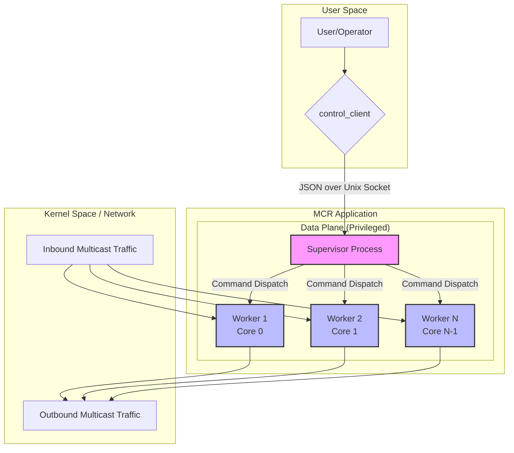
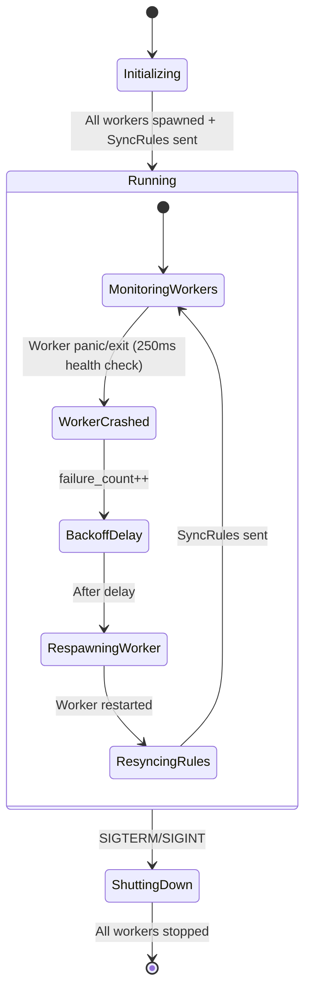

# Multicast Relay - Architecture

**Status:** ✅ CURRENT
**Last Updated:** 2025-11-18

---

This document describes the architecture of the `multicast_relay` application. It is the definitive, up-to-date guide to the system's design, components, and core technical decisions. As the project evolves, this document is updated to reflect the current state of the implementation.

## 1. System Overview

The `multicast_relay` is a high-performance userspace application designed to address the "unroutable source" problem for multicast traffic. It receives multicast UDP packets, which may originate from unroutable sources, and re-transmits them from a routable local interface.

The architecture is designed around three core principles:

1. **Peak Performance:** To handle millions of packets per second by minimizing system calls, memory copies, and cross-core cache misses.
2. **Dynamic Reconfiguration:** To allow for adding, removing, and monitoring forwarding flows at runtime without service interruption.
3. **Testability:** To structure the code in a way that is modular and verifiable.

### Implementation Status

This document describes both **current implementation** and **target architecture**. Features marked with "(NOT IMPLEMENTED)" or "(PARTIALLY IMPLEMENTED)" represent the designed architecture that is not yet fully operational.

**✅ Fully Implemented:**

- Multi-process architecture with supervisor and data plane worker processes
- Unified io_uring-based data plane for packet forwarding
- JSON-based control protocol (AddRule, RemoveRule, ListRules, ListWorkers)
- Fire-and-forget command delivery to workers
- Hash-based ruleset drift detection (manual, via logs)
- Real-time statistics aggregation (pipe-based IPC from workers to supervisor)
- Worker process monitoring and restart with rule resynchronization
- Periodic health checks (250ms with auto-restart + SyncRules)
- Protocol versioning (PROTOCOL_VERSION, GetVersion command)

**⚠️ Partially Implemented:**

- Observability via GetStats (functional, aggregates stats from all workers)

**❌ Not Yet Implemented:**

- Rule hashing to specific CPU cores (all workers receive all rules)
- Automated drift detection and recovery (Phase 2 - detection complete, recovery pending)
- Network state reconciliation via Netlink
- On-demand packet tracing
- Data plane worker privilege dropping (AF_PACKET FD passing)

## 2. Architectural Principles

The current architecture is the result of a significant refactor guided by the following principles:

### 1. Simplicity Through Unification

Use a single, consistent mechanism for asynchronous I/O to reduce complexity and eliminate entire classes of synchronization bugs. The project has standardized on `io_uring` for all performance-critical I/O, and `tokio` for the less-critical supervisor tasks.

### 2. Kernel-Managed State

Let the kernel manage as much state and synchronization as possible. The kernel's event notification mechanisms (e.g., pipes, sockets) are well-tested and highly optimized. This is preferred over custom, error-prone userspace synchronization primitives.

### 3. Zero-Copy Where Possible

Minimize data copying in the fast path. The architecture prefers passing metadata and buffer references between threads and processes over copying entire packets, especially at high packet rates.

### 4. Fail-Fast Error Handling

Worker threads are designed as isolated, restartable processes. They prefer to panic on unrecoverable errors rather than continuing in a potentially corrupt state. The Supervisor process is responsible for monitoring workers and restarting them if they fail.

### 5. Why PACKET_FANOUT_CPU

The per-CPU worker model with `PACKET_FANOUT_CPU` was chosen over alternatives for these reasons:

- **Cache locality:** Packets processed on the same CPU where they arrived stay hot in L1/L2 cache (1-10ns access vs 60ns+ for RAM or cross-CPU coherency).
- **No synchronization:** Each worker is independent with its own ruleset copy. No locks, no contention, no cache-line ping-pong.
- **True parallelism:** N CPUs = N× throughput (typically 40-45× speedup on 48 cores).
- **Fault isolation:** Worker crash affects only that CPU's traffic; supervisor restarts it.

**Trade-offs accepted:**

- Memory overhead: Each worker has full ruleset copy (mitigated by planned rule sharding).
- RSS/RPS dependency: Requires NIC or kernel packet steering configuration.

**Alternatives considered but rejected:**

- Single worker with io_uring: Simpler but bottlenecked at ~1 Gbps.
- Thread pool with shared queue: Loses cache locality, adds lock contention.
- XDP/eBPF: Higher performance but limits flexibility and debuggability.
- DPDK: Maximum performance but requires dedicated CPUs and kernel bypass.

For the 10-40 Gbps target, PACKET_FANOUT_CPU provides the best balance of performance, simplicity, and maintainability.

## 3. High-Level Design

The system is architected as a multi-process application to ensure robust privilege separation and scalability. It is composed of a single supervisor process that manages multiple data plane worker processes.

- **User/Operator:** Interacts with the system via the `control_client`.
- **`control_client`:** A command-line tool that sends JSON commands to the supervisor over a Unix socket.
- **Supervisor Process:** The main process that manages workers, handles configuration commands, and centralizes logging and statistics. It runs with privileges but does not handle high-speed packet forwarding.
- **Worker Processes:** High-performance data plane processes, each pinned to a specific CPU core. They receive, process, and re-transmit all multicast traffic.

## 4. The Data Plane: A Unified, Single-Threaded Architecture

The MCR data plane uses a **single-threaded, unified event loop model**. This eliminates the complexity and performance issues of inter-thread communication. All data plane logic for a given CPU core runs within a single OS thread.

**Implementation:** `run_unified_data_plane()` in `src/worker/data_plane_integrated.rs`

- **Core Affinity:** The supervisor spawns one data plane worker process per designated CPU core, and this worker process is pinned to that core.

- **Unified `io_uring` Instance:** Each worker process uses a **single `io_uring` instance** to manage all asynchronous I/O operations for both ingress and egress. This provides a unified, highly efficient event queue.

**Event Loop Architecture:**

  1. **Ingress (`AF_PACKET`):** The worker submits multiple `Recv` operations to the `io_uring` for its `AF_PACKET` socket.
  2. **Egress (`AF_INET`):** When a received packet is processed and ready to be forwarded, the worker submits one or more `Send` operations to the _same_ `io_uring` instance for the appropriate `AF_INET` egress sockets.
  3. **Unified Completion:** The worker makes a single blocking call (`submit_and_wait()`) that waits for _any_ type of event to complete—a packet being received, a packet having been sent, or a command arriving from the supervisor.
  4. **Processing:** When the loop wakes, it processes all available completion events, frees buffers from sent packets, forwards newly received packets, and then submits new I/O operations to the ring.

### Data Plane Packet Flow

- **Benefits of this Model:**
  - **No Inter-Thread Communication:** This architecture completely eliminates the need for complex, performance-sapping cross-thread communication mechanisms.
  - **Simplified Buffer Management:** The buffer pool is owned and accessed by a single thread, removing the need for `Arc<Mutex>` or other synchronization primitives.
  - **Natural Batching:** The single event loop naturally batches both receive and send operations, maximizing `io_uring`'s efficiency.

- **Filtering and Demultiplexing:**
  - **Hardware Filtering:** The primary filtering is done by the NIC hardware. For each multicast group we need to receive, a standard `AF_INET` "helper" socket is created solely to trigger the kernel to send an IGMP Join and program the NIC's MAC address filter.
  - **Userspace Demultiplexing:** The `AF_PACKET` socket receives all relevant multicast frames. The unified event loop inspects the headers of each packet to identify its destination group/port and looks up the corresponding `ForwardingRule` in a hash map.

- **Egress Path and Zero-Copy Fan-Out:** MCR now supports high-performance, multi-output "fan-out." When a packet needs to be forwarded to multiple destinations, the payload of the single received packet is wrapped in a reference-counted pointer (`Arc<[u8]>`). This allows the same memory to be queued for sending on multiple egress sockets without any memory copying, which is critical for scalable performance. This also applies to single-output forwarding, eliminating the previous `memcpy` overhead.

  The application utilizes three distinct egress paths:
  1. **Control Interface:** Uses `AF_UNIX` sockets for local IPC. MTU is not applicable.
  2. **IGMP Signaling:** Uses `AF_INET` sockets managed by the Supervisor. MTU is not a practical concern.
  3. **Fast Data Path:** Uses `AF_INET` sockets managed by the data plane workers. This is the exclusive subject of all high-performance design decisions concerning MTU handling, fragmentation, and NIC offloading.

- **Egress Error Handling:** The application will use a "Drop and Count" strategy for transient egress errors. Packets that fail to send due to transient errors will be dropped immediately, with no retry mechanism, to preserve low latency and prevent head-of-line blocking. A new metric, `egress_errors_total`, will be tracked on a per-output-destination basis and exposed via the control interface to provide immediate visibility into egress failures.

- **No IP Reassembly:** The application will not support IP fragmentation. The data plane will inspect the IP header of every incoming packet to identify fragments. Any packet identified as a fragment (either the first, middle, or last) will be immediately dropped. A new metric, `ip_fragments_dropped_total`, will be tracked on a per-core basis and exposed via the control interface to make the presence of fragmented traffic visible to the operator.

- **Egress Fragmentation by Kernel:** The application will not implement userspace IP fragmentation. It will always present the complete, reconstructed datagram (UDP payload) to the egress `AF_INET` socket, regardless of size. The application will rely entirely on the Linux kernel's IP stack to perform any necessary fragmentation on the egress path if a packet's size exceeds the egress interface's MTU. The operational documentation will strongly recommend that operators maintain consistent MTU sizes across the data path to avoid performance degradation from fragmentation, and will instruct them to use tools like `netstat` to monitor for kernel-level fragmentation.

### Interface Management

- **Explicit Interface Configuration:** The `ForwardingRule` structure includes a mandatory `input_interface` field. The application supports configuring rules across multiple distinct input and output interfaces. Each core-pinned data plane thread is designed to manage `AF_PACKET` sockets for multiple ingress interfaces simultaneously, if required.

- **Nuanced NIC Offloading:** For the application to function correctly, NIC offloading features that coalesce packets must be disabled on all ingress interfaces. Generic Receive Offload (GRO) and Large Receive Offload (LRO) **must be disabled** on all `input_interface`s. These features are fundamentally incompatible with the application's `AF_PACKET` processing model and can cause artificial jumbo frames, leading to unnecessary egress fragmentation. For egress offloads (GSO/TSO), the recommendation depends on the operator's goal: for handling MTU mismatches, it is **recommended to enable** GSO/TSO on the egress interface; for maximum predictability or performance testing, it is **recommended to disable** GSO/TSO. These explicit, nuanced recommendations will be a critical part of the operational documentation.

## 5. The Control Interface

The control interface provides runtime configuration and monitoring. The supervisor handles all control operations directly via a Unix domain socket.

- **Centralized in Supervisor:** Control socket handling runs within the supervisor's tokio async runtime.
- **Communication:** Listens on a Unix Domain Socket for local, secure communication.
- **Protocol:** Uses a **JSON**-based protocol for commands and responses. This was chosen for ease of debugging, testing, and future interoperability over the negligible performance gains of a binary format for this interface.
- **Protocol Versioning:** A `PROTOCOL_VERSION` constant is compiled into the application. The `GetVersion` command returns this version for client compatibility checks.
- **Server-Side Idempotency:** The supervisor generates a unique ID for each new rule upon creation, and this ID is returned in the `AddRule` success response. The `ListRules` command is the primary mechanism for a client to reconcile its state after a disconnect or timeout.

### Rule Assignment

- **Rule-to-Core Assignment Strategy (NOT IMPLEMENTED):** _Future work:_ The application is designed to use a hybrid strategy for assigning forwarding rules to data plane cores using a consistent hash of the rule's stable identifiers (e.g., `input_group`, `input_port`). **Current implementation:** All rules are broadcast to all data plane workers. Each worker maintains a complete copy of the ruleset and processes packets for any matching rule. This simplifies implementation but reduces cache locality and limits scalability.

- **Statistics Aggregation:** Data plane workers push statistics to the supervisor via pipes. The supervisor aggregates stats from all workers and returns them via the `GetStats` command.

- **Command Dispatch via Unix Sockets (Fire-and-Forget):** Communication from the Supervisor to the data plane worker processes uses a dedicated `UnixStream` socket pair for each worker.
  - The Supervisor serializes commands (e.g., `AddRule`, `RemoveRule`, `SyncRules`) into a length-prefixed JSON payload and writes them to its end of the socket using its `tokio` runtime.
  - The worker's `io_uring` runtime polls its end of the socket. When data arrives, a command reader parses the length-prefixed JSON back into a command struct for processing.
  - This mechanism bridges the supervisor's `tokio`-based async runtime and the worker's `io_uring`-based data plane.

  **Reliability Characteristics:**
  - **Fire-and-Forget Delivery:** The supervisor broadcasts commands to all workers asynchronously. Send errors are **explicitly ignored** to prioritize supervisor responsiveness over guaranteed delivery.
  - **No Acknowledgments:** Workers do not send acknowledgments when they receive or process commands.
  - **No Retries:** Failed sends are not retried. If a worker's socket buffer is full or the worker is unresponsive, the command is silently lost.
  - **Eventual Consistency:** The system is designed for eventual consistency. The supervisor's `master_rules` HashMap is the authoritative source of truth. Workers may temporarily have stale state due to lost broadcasts.
  - **Rule Resynchronization:** When workers restart, the supervisor sends a `SyncRules` command with the complete ruleset. Periodic health checks (every 250ms) detect dead workers and trigger automatic restart with rule resync.
  - **Drift Detection:** Hash-based drift detection enables manual detection of workers with stale rulesets by comparing hash values in log output. Each component (supervisor, workers) logs a hash of its ruleset when rules change.

## 6. Monitoring and Hotspot Strategy

- **Hotspot Management (Observe, Don't Act):** The initial design will not implement an automatic hotspot mitigation strategy. Instead, it will rely on a robust, **core-aware monitoring system** to make any potential single-core saturation observable to the operator.

  **Current Status:**
  - **Statistics Collection:** Data plane workers push per-flow statistics (packets/bytes relayed, packets/bits per second) to the supervisor via pipes.
  - **Aggregation:** The supervisor aggregates statistics from all workers, summing counters and rates for flows handled by multiple workers (via PACKET_FANOUT_CPU).
  - **Manual monitoring:** Operators can use standard tools (`top`, `htop`) to observe per-core CPU usage.

- **Custom Observability via Control Interface:** The application provides observability through its control interface, compensating for the lack of visibility from standard networking tools like `netstat`.

  **Available Commands:**
  - **ListRules:** Returns the complete forwarding table from the supervisor's authoritative `master_rules`.
  - **ListWorkers:** Returns information about all spawned worker processes (PID, type, core assignment).
  - **GetStats:** Returns aggregated statistics from all data plane workers (packets/bytes relayed, rates per flow).
  - **GetVersion:** Returns the protocol version for client compatibility checks.

- **On-Demand Packet Tracing (NOT IMPLEMENTED):** _Future work:_ The application will implement a low-impact, on-demand packet tracing capability. Tracing will be configurable on a per-rule basis via control interface commands (`EnableTrace`, `DisableTrace`, `GetTrace`) and disabled by default. Each data plane worker will maintain a pre-allocated, in-memory ring buffer to store key diagnostic events for packets matching an enabled rule. The `GetTrace` command will retrieve these events, providing a detailed, chronological log of a packet's lifecycle or the reason for its drop.

## 7. Logging Architecture

Worker processes do not log directly to files. Instead, a simple and robust pipe-based mechanism decouples the high-performance workers from slower I/O by centralizing logging in the supervisor. Workers emit logs as a fast "fire-and-forget" operation into a pipe, and the supervisor asynchronously reads from these pipes, aggregates the messages, and prints them to its standard output.

For a comprehensive guide to the logging system, including the high-performance cross-process design for the data plane, API usage, and monitoring techniques, see the detailed **[Logging Design Document](../design/LOGGING_DESIGN.md)**.

## 8. Statistics Reporting Architecture

### Design Principles for Data Plane Stats

The statistics reporting system must respect critical fast path constraints to maintain high-performance packet forwarding:

**Fast Path Constraints:**

1. **Minimize System Calls:** The packet processing loop must avoid syscalls where possible. Even amortized periodic syscalls add measurable latency at high packet rates.
2. **No Locks/Mutexes:** Data plane is single-threaded by design to eliminate synchronization overhead.
3. **Never Block:** Data plane must continue processing packets without waiting for I/O operations.
4. **No Dynamic Allocation:** Memory allocation in the fast path causes unpredictable latency.
5. **Fire-and-Forget Only:** Data plane should push stats asynchronously, never respond to queries.

**Architectural Decision:** Data plane workers **push** statistics periodically to the supervisor via pipes. They do NOT handle request-response IPC (no stats queries). This keeps the data plane event loop simple and focused solely on packet forwarding.

### Current Implementation

**✅ Fully Implemented:**

- Per-flow counters tracked in data plane workers (`flow_counters: HashMap<(Ipv4Addr, u16), FlowCounters>`)
- Rate calculation (packets_per_second, bits_per_second) using snapshot-based deltas
- Pipe-based IPC: Workers write stats to dedicated pipes, supervisor reads asynchronously
- Supervisor aggregates stats from all workers (summing counters and rates for PACKET_FANOUT flows)
- `GetStats` returns real aggregated data

**Implementation Details:**

1. **Worker → Supervisor:** Stats written to dedicated pipe per worker (JSON-serialized `Vec<FlowStats>`)
2. **Timing:** Stats pushed at configurable reporting interval (default 10 seconds)
3. **Non-blocking:** Workers use non-blocking writes; on buffer full, update is dropped
4. **Aggregation:** Supervisor sums stats across workers for flows distributed via PACKET_FANOUT_CPU

**Performance Characteristics:**

- Stats written during periodic interval (off critical per-packet path)
- Fire-and-forget: write failures don't block packet processing
- Overhead: ~1 `write()` syscall per reporting interval per worker

### Fast Path Guarantee

**Critical Constraint:** Stats writes must NEVER block packet processing. Implementation guarantees:

- Non-blocking writes (O_NONBLOCK)
- Failure handling: drop stats update, continue processing
- No synchronous I/O in packet processing loop
- Periodic stats writes only (not per-packet)

## 9. Memory Management

- **Core-Local Buffer Pools:** To avoid the performance penalty of dynamic memory allocation, the application uses a core-local buffer pool strategy. Each core-pinned data plane thread pre-allocates and manages its own independent set of fixed-size memory buffers. These buffers are organized into multiple pools based on common packet sizes (e.g., Small, Standard, Jumbo). Runtime "allocations" are fast, lock-free operations that acquire a buffer from the appropriate pool.

- **Buffer Pool Observability:** The system is designed to handle buffer pool exhaustion by dropping packets rather than falling back to slow, dynamic allocation. To make this manageable, the monitoring system exposes detailed, per-core, per-pool metrics, including the total size of each pool, the current number of buffers in use, and a counter for exhaustion events.

## 9. Reliability and Resilience

- **Supervisor Pattern for Resilience (PARTIALLY IMPLEMENTED):** The application implements a supervisor pattern. The main supervisor process is responsible for the lifecycle of the data plane worker processes.

  **Current Implementation:**
  - **Worker Process Monitoring:** The supervisor monitors child worker processes for crashes.
  - **Worker Restart:** The supervisor can restart failed worker processes.
  - **Exponential Backoff:** _(Status Unknown - needs verification)_ The exponential backoff strategy for restart may not be fully implemented.

  **Critical Limitation - No Rule Resynchronization:**
  - When a worker process is restarted, it starts with an **empty ruleset**.
  - The supervisor **does not** automatically send existing rules to newly started workers.
  - **Impact:** ~~A restarted worker will drop all traffic until new rules are explicitly added.~~ **RESOLVED:** Workers now receive `SyncRules` on restart.
  - **Current Behavior:** When a worker restarts, the supervisor automatically sends a `SyncRules` command with the complete ruleset.

- **Worker Drift Detection (IMPLEMENTED):** Hash-based drift detection enables manual identification of workers with stale rulesets:
  - Each component (supervisor, data plane workers) logs a hash of its ruleset when rules change.
  - Operators can compare hashes in logs to detect when worker state diverges from supervisor's authoritative `master_rules`.
  - **Manual process:** No automated comparison or recovery yet.

- **Network State Reconciliation (NOT IMPLEMENTED):** _Future work:_ A high-priority item on the roadmap is to implement idempotent network state reconciliation. The target design is for the supervisor to use a Netlink socket to listen for network state changes (e.g., interfaces going up or down). This would allow it to automatically pause, resume, or re-resolve forwarding rules as network conditions change.

### Supervisor Lifecycle Management

**Current Behavior:**

- Workers receive full ruleset via `SyncRules` on initial startup
- Health checks run every 250ms to detect crashed workers
- Crashed workers are restarted with exponential backoff
- Restarted workers receive `SyncRules` with complete ruleset

## 10. Security and Privilege Model

### Current Implementation vs. Target Architecture

**Current Multi-Process Architecture:**

The application uses a **multi-process architecture** where components run as separate OS processes:

- **Supervisor Process**: Main tokio-based async process that spawns and monitors workers, handles control socket
- **Data Plane Workers**: Separate processes, one per CPU core

Each worker is spawned as a separate OS process with its own PID using `tokio::process::Command`.

**Privilege Separation Status:**

⚠️ **Data Plane Workers**: Currently **do NOT drop privileges** and run as root. This is a known limitation documented in the code (see `src/worker/mod.rs`). Data plane workers require `CAP_NET_RAW` to create `AF_PACKET` sockets, and the ambient capabilities workaround doesn't survive `setuid()`.

**Target Architecture (Future Work):**

The goal is to implement file descriptor passing so the Supervisor creates `AF_PACKET` sockets and passes them to data plane workers via `SCM_RIGHTS`. This would allow data plane workers to drop ALL privileges completely while still being able to use the pre-created sockets. This is a **high-priority future work item**.

- **DDoS Amplification Risk (Trusted Network & QoS Mitigation):** The risk of DDoS amplification from external, malicious actors is considered mitigated by the operational requirement that the relay's ingress interfaces are connected only to physically secured, trusted network segments. The risk of accidental overload of a unicast destination due to misconfiguration is fully mitigated by the existing advanced QoS design, which allows for the classification and rate-limiting/prioritized dropping of high-bandwidth flows. No additional security-specific mechanisms are required for this threat vector.
