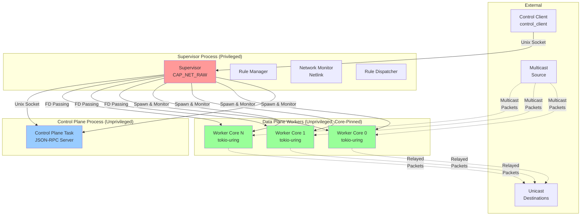
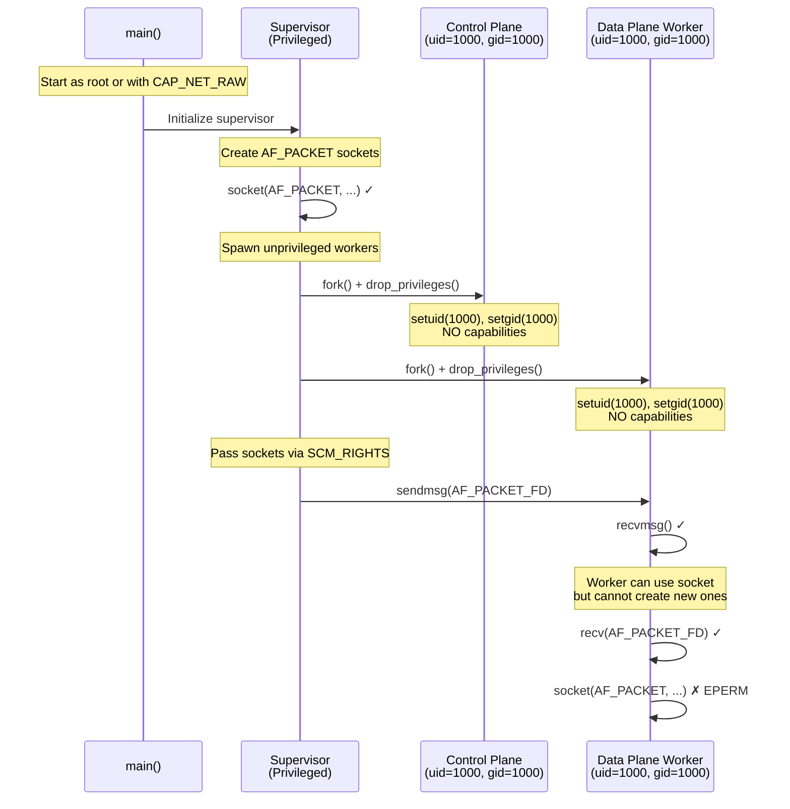
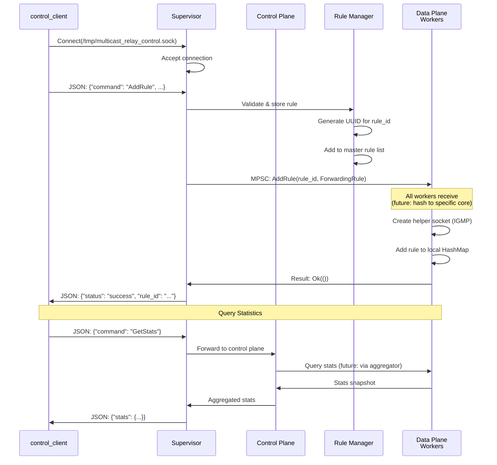
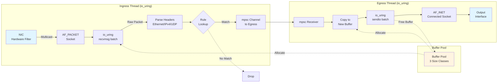
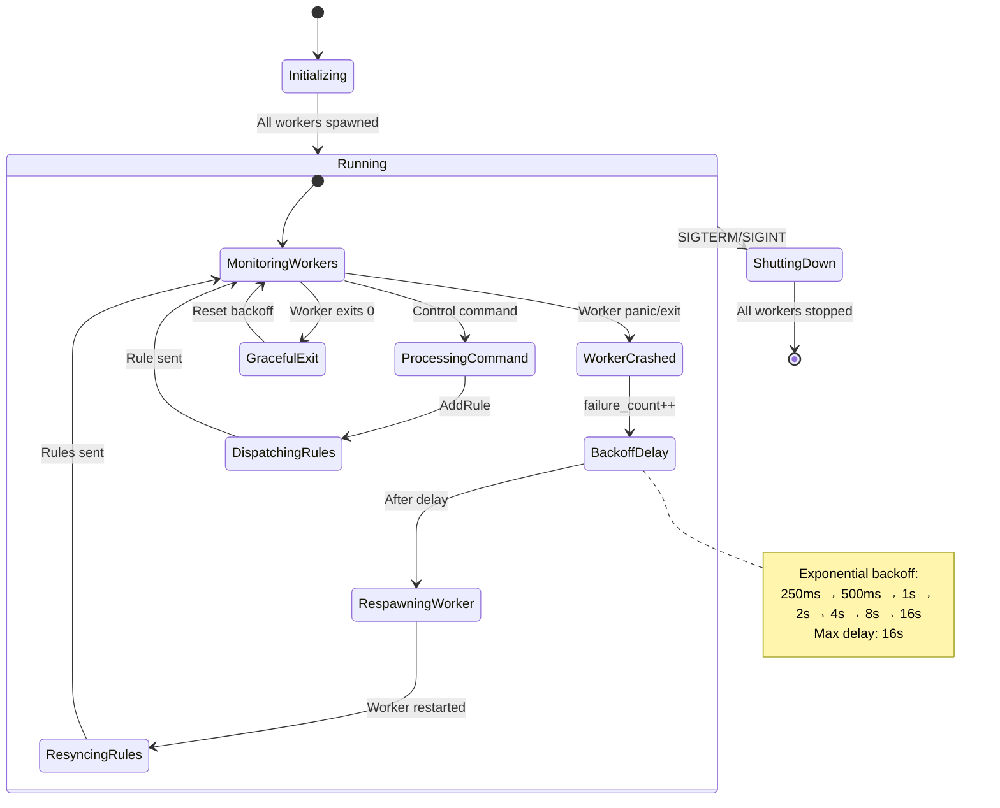
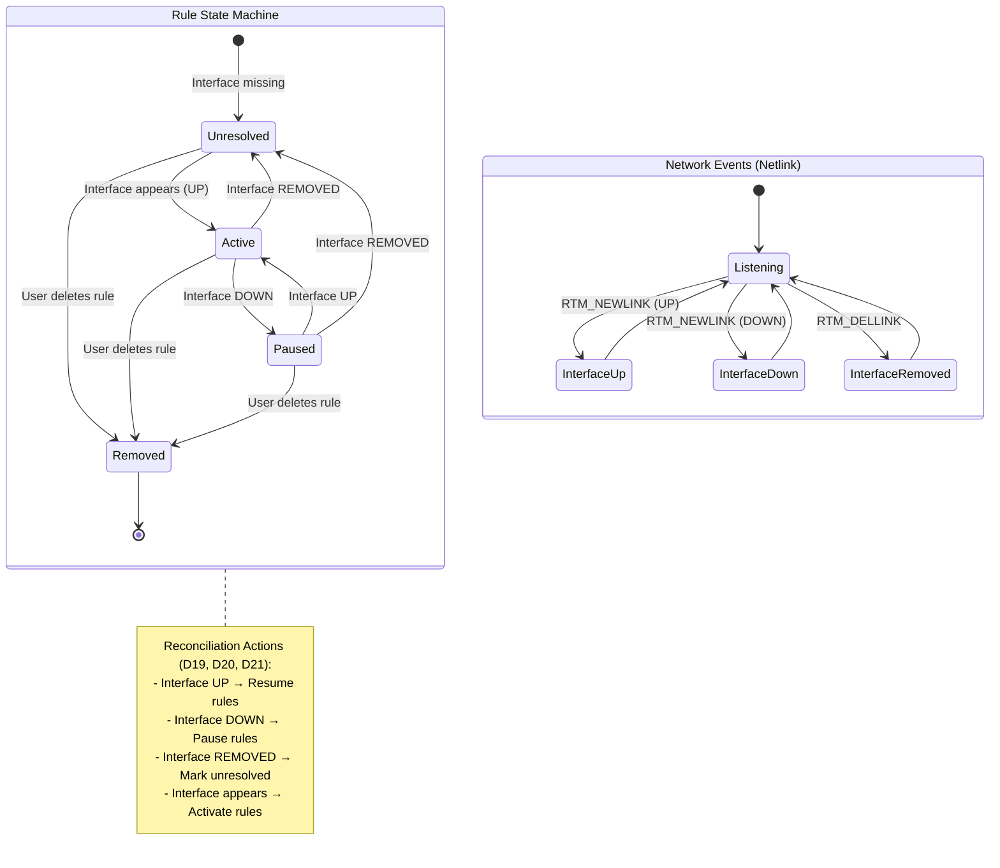
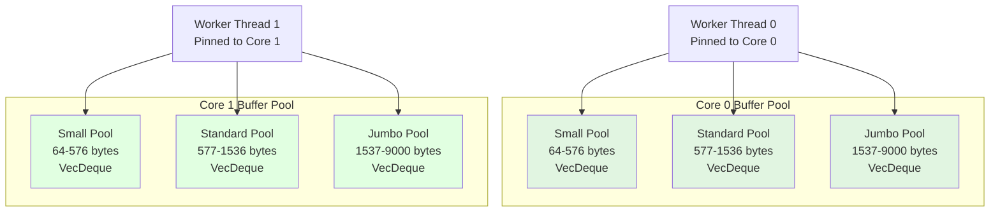
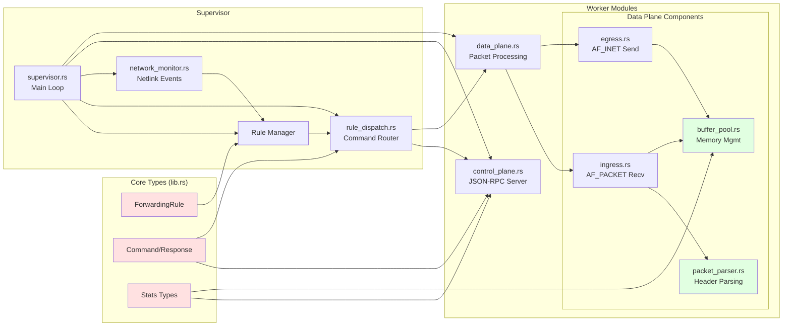

# Architecture Diagrams

This document provides visual representations of the multicast relay architecture, component interactions, and data flows.

## Table of Contents
1. [High-Level System Architecture](#1-high-level-system-architecture)
2. [Process Model & Privilege Separation](#2-process-model--privilege-separation)
3. [Control Plane Communication Flow](#3-control-plane-communication-flow)
4. [Data Plane Packet Flow](#4-data-plane-packet-flow)
5. [Supervisor Lifecycle Management](#5-supervisor-lifecycle-management)
6. [Network Monitoring & Reconciliation](#6-network-monitoring--reconciliation)
7. [Buffer Pool Architecture](#7-buffer-pool-architecture)
8. [Component Dependency Graph](#8-component-dependency-graph)

---

## 1. High-Level System Architecture



**Key:**
- 🔴 Red = Privileged process (CAP_NET_RAW)
- 🔵 Blue = Unprivileged control plane
- 🟢 Green = Unprivileged data plane workers

---

## 2. Process Model & Privilege Separation



**Security Model:**
- Only supervisor retains `CAP_NET_RAW`
- Workers cannot escalate privileges
- Socket FDs passed via Unix domain sockets (SCM_RIGHTS)
- Each worker process isolated

---

## 3. Control Plane Communication Flow



**Two-Socket Design:**
1. Client ↔ Supervisor: `/tmp/multicast_relay_control.sock`
2. Supervisor ↔ Control Plane: `/tmp/mcr_relay_commands.sock`

---

## 4. Data Plane Packet Flow



**Key Design Decisions:**
- **Memory Copy**: Ingress → Egress decouples paths (D5)
- **Batching**: io_uring submits 32-64 ops at once (D7, D8)
- **Zero-Copy Within Stage**: Buffer ownership transferred via channel
- **Buffer Pool**: Lock-free allocation, per-core (D15)

---

## 5. Supervisor Lifecycle Management



**Resilience Features (D18):**
- Automatic worker restart on failure
- Exponential backoff prevents restart loops
- Master rule list re-synchronized on restart
- Graceful exit (status 0) resets backoff counter

---

## 6. Network Monitoring & Reconciliation



**Network Monitor Design:**
- Supervisor listens to Netlink events (NETLINK_ROUTE)
- Rule state tracked independently of interface state
- Automatic reconciliation when interfaces change
- Idempotent: Rules can be added before interface exists

---

## 7. Buffer Pool Architecture



**Buffer Pool Strategy (D15, D16):**
- **Per-Core Pools**: No cross-core contention, cache-friendly
- **Size Classes**: Minimize waste (Small: 64B, Std: 1500B, Jumbo: 9000B)
- **Lock-Free**: `VecDeque::pop_front()` / `push_back()` are O(1)
- **Pre-Allocated**: 1024 buffers/pool at startup
- **Observability**: Track total/allocated/exhaustion per pool (D16)

**Performance:** 37.6M alloc/sec, 1.79x faster than `Vec` (Experiment #3)

---

## 8. Component Dependency Graph



**Dependency Layers:**
1. **Core Types** (lib.rs): Shared data structures, zero dependencies
2. **Supervisor**: Orchestration, lifecycle management
3. **Worker Modules**: Control plane + data plane workers
4. **Data Plane Components**: High-performance packet processing

---

## ASCII Art Diagrams (Terminal-Friendly)

### Simple System Overview

```
┌─────────────────────────────────────────────────────────────────┐
│                    Multicast Relay System                       │
└─────────────────────────────────────────────────────────────────┘

External:                     Supervisor (Privileged):
┌──────────────┐             ┌──────────────────────────┐
│ Control      │────UDS─────▶│ Rule Manager             │
│ Client       │             │ Network Monitor          │
└──────────────┘             │ Lifecycle Mgmt           │
                             └─┬──────────────────────┬─┘
┌──────────────┐               │                      │
│ Multicast    │               │FD Pass              │FD Pass
│ Source       │               ▼                      ▼
└──────────────┘     ┌─────────────────┐   ┌─────────────────┐
                     │ Control Plane   │   │ Data Plane      │
┌──────────────┐     │ (Unprivileged)  │   │ Workers (x N)   │
│ Unicast      │     │                 │   │ (Unprivileged)  │
│ Destinations │◀────│ JSON-RPC Server │   │ Core-Pinned     │
└──────────────┘     └─────────────────┘   └─────────────────┘
                             ▲                      ▲
                             │                      │
                             └──────UDS─────────────┘
```

### Packet Flow (Simple)

```
Multicast Packet Flow:
════════════════════════════════════════════════════════════

 NIC          AF_PACKET      Parse       Lookup      Channel
  │              │             │            │            │
  ├─┬─┬─┬──────▶ │             │            │            │
  │ │ │ │        ├──Batch─────▶│            │            │
  │ │ │ │        │             ├─Extract────▶│            │
  │ │ │ │        │             │            ├─Match──────▶│
  │ │ │ │        │             │            │            │
  └─┴─┴─┴────────┴─────────────┴────────────┴────────────┘
    32-64 packets buffered via io_uring

  Channel      Copy        io_uring      AF_INET     Output
     │           │            │             │           │
     ├──────────▶│            │             │           │
     │           ├─Allocate───▶│             │           │
     │           │            ├──Batch──────▶│           │
     │           │            │             ├──────────▶ │
     │           │            │             │           │
     └───────────┴────────────┴─────────────┴───────────┘
                    32-64 packets sent via io_uring
```

### Worker Lifecycle States

```
Worker Lifecycle:
═════════════════

                    ┌────────────┐
                    │  Spawned   │
                    └──────┬─────┘
                           │
                    ┌──────▼─────┐
                    │  Running   │◀─────────┐
                    └─┬────────┬─┘          │
                      │        │            │
            ┌─────────┘        └────────┐   │
            │                           │   │
      ┌─────▼──────┐             ┌──────▼───┴──┐
      │  Crashed   │             │  Exited(0)  │
      └─────┬──────┘             └──────┬──────┘
            │                           │
      ┌─────▼──────┐                    │
      │ Backoff    │                    │
      │ Delay      │                    │
      └─────┬──────┘                    │
            │                           │
            └─────────┬─────────────────┘
                      │
                ┌─────▼──────┐
                │ Respawned  │
                └─────┬──────┘
                      │
                      └──────── Re-sync Rules ───────┐
                                                      │
                                                      ▼
```

---

## Diagram Rendering

These diagrams use **Mermaid** syntax, which is supported by:

- ✅ **GitHub** (renders automatically in .md files)
- ✅ **GitLab** (renders automatically)
- ✅ **VS Code** (with Markdown Preview Mermaid Support extension)
- ✅ **JetBrains IDEs** (built-in support)
- ✅ **Notion** (paste as diagram)
- ✅ **Mermaid Live Editor** (https://mermaid.live)

To render locally:
```bash
# Install mermaid-cli
npm install -g @mermaid-js/mermaid-cli

# Render to PNG
mmdc -i docs/ARCHITECTURE_DIAGRAMS.md -o diagrams/
```

---

## References

- **ARCHITECTURE.md**: Design decisions (D1-D33)
- **IMPLEMENTATION_PLAN.md**: Phased development approach
- **Audit Report**: Component status and validation
- **Experiments**: Performance validation (experiments/README.md)

**Last Updated:** 2025-11-08
