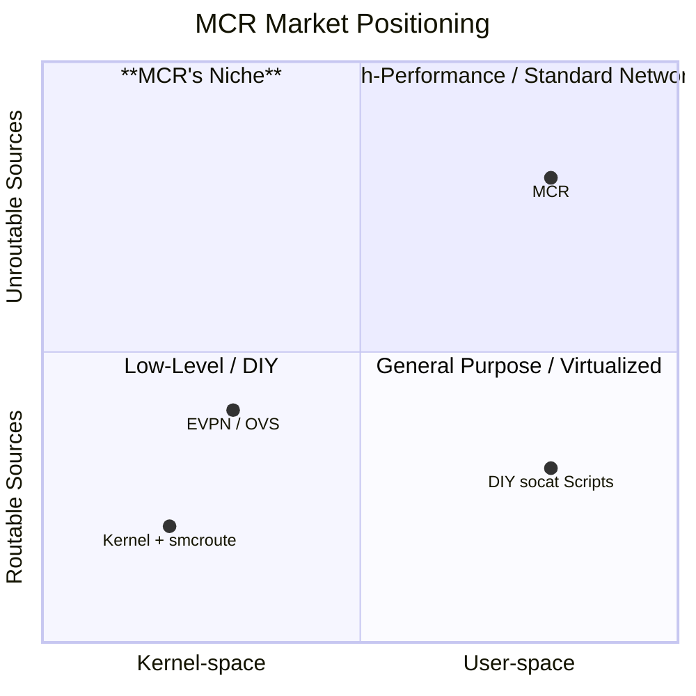

# MCR Strategic Analysis v2.0

## 1. Executive Summary

This document presents the refined v2.0 strategy for the Multicast Relay (MCR) project, incorporating findings from a rigorous adversarial analysis.

**The Opportunity:** MCR addresses a persistent and critical niche problem: relaying multicast traffic from sources with **unroutable IP addresses**. This issue is prevalent in the **Broadcast**, **Industrial OT**, and **R&D/Test** sectors due to long hardware lifecycles and the architectural limitations of the Linux kernel, which make a user-space relay the only viable solution.

**Our Solution:** MCR is a specialized, user-space multicast relay. The v2 strategy evolves MCR from a simple tool into a sustainable project with a clear path to enterprise-readiness.

**The Business Model (Open Core):**
*   **Community Edition (Free):** A full-featured core relay to drive bottom-up adoption, primarily through the R&D/Test community.
*   **Commercial Editions (Subscription):** Paid tiers (Professional/Enterprise) offering a GUI, enterprise integrations (Ansible/Terraform), High Availability (HA) support, and 24/7 SLAs. This provides a sustainable revenue stream to fund development.

**Go-to-Market (Product-Led Growth):**
Our strategy is a "Trojan Horse" model. We will win over **R&D/QA engineers** with a frictionless, open-source tool that solves their immediate automation challenges. Their success will create internal champions, paving the way for enterprise-wide adoption in mission-critical Broadcast and OT environments.

**Strategic Vision (From Component to Platform):**
We recognize the risk of being a low-value "component." Our long-term vision is to evolve MCR from a simple relay into an **observability and control platform** for specialized media and industrial data streams, providing valuable metrics, analytics, and security features.

**Key Strategic Shifts in v2.0:**
*   **From Tool to Business:** Defining a clear Open Core business model and support structure.
*   **From Hope to Strategy:** Implementing a deliberate, product-led GTM plan.
*   **From Component to Platform:** Establishing a long-term vision beyond simple relaying.
*   **From On-Premise to Hybrid-Cloud:** Embracing the role of MCR as the essential on-premise bridge for connecting legacy hardware to the cloud.

---

## 2. Core Hypothesis & Risk Analysis

Our strategy is built on a core set of assumptions. This section makes them explicit and outlines our mitigation strategy.

*   **Core Assumption #1: The Niche is Durable.** We assume the "unroutable source" problem will persist for the next 5-10 years due to long hardware refresh cycles in our target industries.
    *   **Risk:** Rapid hardware modernization makes the problem obsolete.
    *   **Mitigation:** Focus on the hybrid-cloud use case, which provides value even for modern hardware by bridging on-premise multicast to cloud unicast.

*   **Core Assumption #2: Users Want a Standalone Tool.** We assume users prefer a dedicated, best-of-breed tool for this problem rather than waiting for the feature to be added to a platform they already use.
    *   **Risk:** A major platform (e.g., a network monitor or even `socat`) adds a "good enough" relay feature, commoditizing our core function.
    *   **Mitigation:** Rapidly execute on the vision to move "up the value chain" from a simple relay to an observability platform. By providing deep, protocol-aware analytics for media/OT streams, we create a defensible value proposition beyond what a generic platform would offer.

---

## 3. Market Analysis & Personas

*(This section remains largely the same as v1, with the addition of the Hybrid-Cloud context.)*

### 3.1. Market Positioning

The chart below positions MCR in a unique niche, defined by its user-space implementation which is essential for handling unroutable source addresses.

### 3.2. User Personas & The Hybrid-Cloud Use Case

Our target personas remain the **Broadcast Engineer**, **Industrial OT Engineer**, and **R&D/QA Engineer**. The rise of hybrid-cloud architectures makes MCR's role even more critical for all three. Since public clouds lack native multicast support, MCR serves as the essential **on-premise bridge**, subscribing to local multicast streams and forwarding them (often via secure unicast) to cloud-based services for processing and analytics.

*(The detailed persona descriptions and network diagrams from v1 are retained here.)*

---

## 4. Product Strategy & Roadmap

Our product strategy is to win initial adoption with a simple, powerful open-source tool and then expand its capabilities to serve enterprise needs.

### 4.1. The Open Core Model

| Edition         | Features                                                              | Target Audience      | Support Model      |
| :-------------- | :-------------------------------------------------------------------- | :------------------- | :----------------- |
| **Community**   | Core Relay Engine, REST API                                           | R&D, QA, Individuals | Community (GitHub) |
| **Professional**| + Web GUI, HA Templates, Ansible/Terraform Providers                  | SMB, Departmental    | Business Hours SLA |
| **Enterprise**  | + Advanced Metrics, RBAC, 24/7 Mission-Critical SLA, Dedicated Support | Large Enterprise     | 24/7 SLA           |

### 4.2. High-Level Roadmap

**Phase 1: Establish the Beachhead (Community Edition)**
*   **Focus:** Frictionless developer experience.
*   **Key Features:**
    *   Core relaying engine with solid performance.
    *   Simple, well-documented REST API.
    *   Easy installation via Docker and single binaries.
    *   Excellent, example-driven documentation focused on the R&D/QA persona.

**Phase 2: Cross the Chasm (Professional Edition)**
*   **Focus:** Enterprise readiness and automation.
*   **Key Features:**
    *   `/healthz` endpoint for HA integration.
    *   Official Terraform Provider and Ansible Collection.
    *   Simple, effective Web GUI.
    *   Reference architectures for secure DMZ deployment and HA with `keepalived`.

**Phase 3: Move Up the Value Chain (Enterprise Edition)**
*   **Focus:** From relay to observability platform.
*   **Key Features:**
    *   Per-stream metrics (throughput, packet loss, jitter) exposed via API and GUI.
    *   Role-Based Access Control (RBAC) for the management plane.
    *   Advanced dashboards for visualizing stream health.
    *   (Future) Protocol-aware analytics for SMPTE 2110, Dante, or SCADA.

---

## 5. Go-to-Market (GTM) Strategy

Our GTM strategy is a **bottom-up, product-led "Trojan Horse" model**.

1.  **The Target:** We will focus our marketing and community efforts almost exclusively on the **R&D/QA Test Engineer**. They have the autonomy to adopt new tools, a clear need for automation, and represent the lowest-risk entry point into an enterprise.

2.  **The Weapon:** The free, open-source **MCR Community Edition**. The product experience itself is the primary marketing tool.

3.  **The Tactics:**
    *   **Content Marketing:** Create highly technical, problem-solving content (blogs, tutorials) that engineers are actively searching for. The focus is on education, not selling.
    *   **Community Engagement:** Be an active, helpful participant in the online communities where our target users live (Reddit, Stack Overflow, industry forums).
    *   **Frictionless Onboarding:** Ensure the "time-to-first-win" for a new user is under 5 minutes.

4.  **The Expansion:** Once MCR is established in the test labs of an organization, it becomes a trusted, proven entity. When a production team (Broadcast or OT) encounters a similar problem, MCR is the obvious, low-risk solution. This creates a warm, inbound lead for the commercial **Professional** or **Enterprise** editions, driven by the need for support, HA, and manageability.
